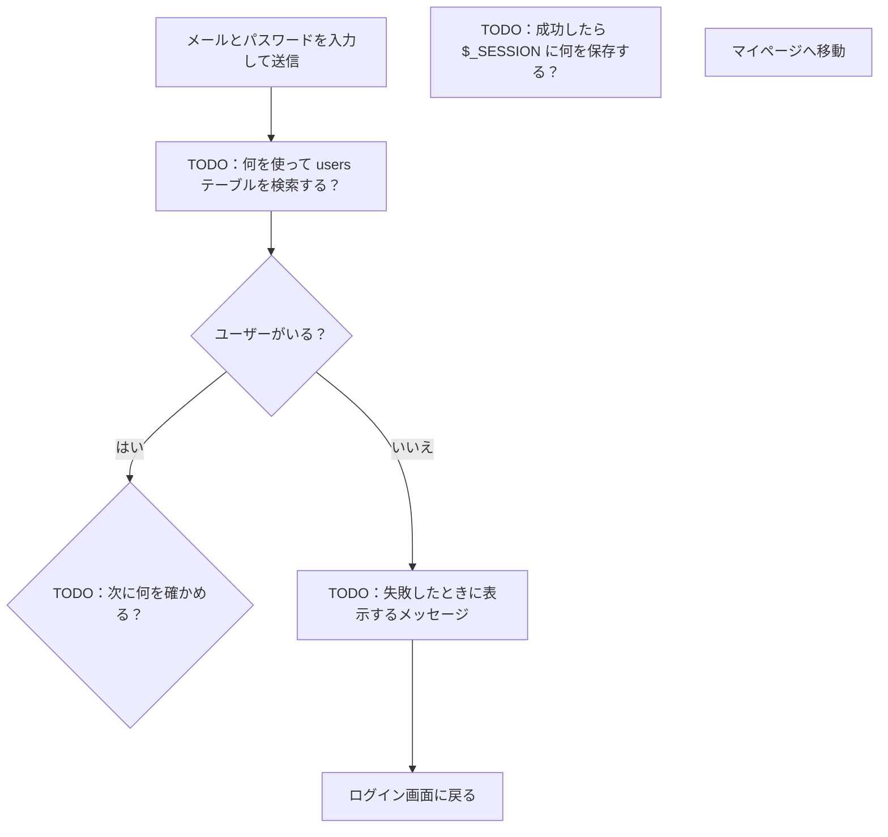

# ログイン画面の設計書

第7回の課題（初級）。`TODO` と書かれたところを、自分の言葉で書き換える。
このファイルは `docs/login-design.md` として自分のリポジトリに置き、PRで提出する。

## ① ログイン画面の入力項目

| 項目 | 入力形式 | 必須 |
|---|---|---|
| メールアドレス | TODO | TODO |
| パスワード | TODO | TODO |
| ログインボタン | TODO | ― |

- 入力形式は、HTML の `<input type="…">` の種類で書く（`text`・`email`・`password`・`submit` など）
- 必須なら `○` と書く

## ② 処理の流れ

- `%%` で始まる行はメモ（図には出ない）。書き終わったら消してよい
- 「ユーザーがいない」と「パスワードが違う」は、**同じエラーメッセージ（E）** につなぐ
- VS Code のプレビューでは図にならない。push して GitHub で開いたときに図になっていればOK
