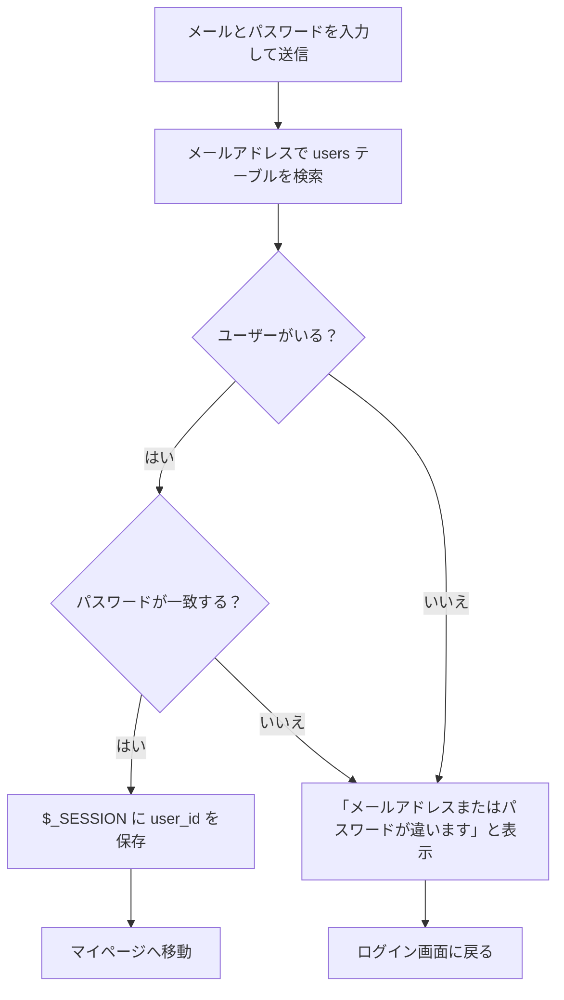

## ② 処理の流れ

```mermaid
flowchart TD
    A["メールとパスワードを入力して送信"]
    B["メールアドレスで users テーブルを検索"]
    C{"ユーザーがいる？"}
    D{"パスワードが一致する？"}
    E["「メールアドレスまたはパスワードが違います」と表示"]
    F["$_SESSION に user_id を保存"]
    G["マイページへ移動"]
    H["ログイン画面に戻る"]

    A --> B
    B --> C
    C -->|はい| D
    C -->|いいえ| E
    E --> H
    D -->|はい| F
    D -->|いいえ| E
    F --> G
```

- `%%` で始まる行はメモ（図には出ない）。書き終わったら消してよい。
- 「ユーザーがいない」と「パスワードが違う」は、同じエラーメッセージ（E）につなぐ。
- VS Code のプレビューでは図にならない場合があるため、push した後に GitHub で確認する。
